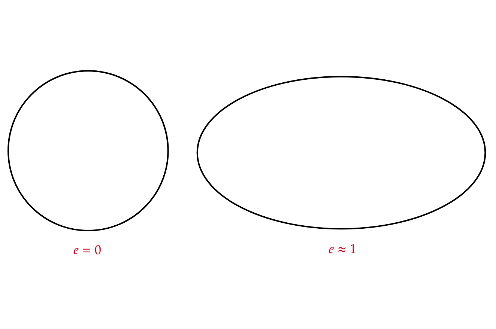
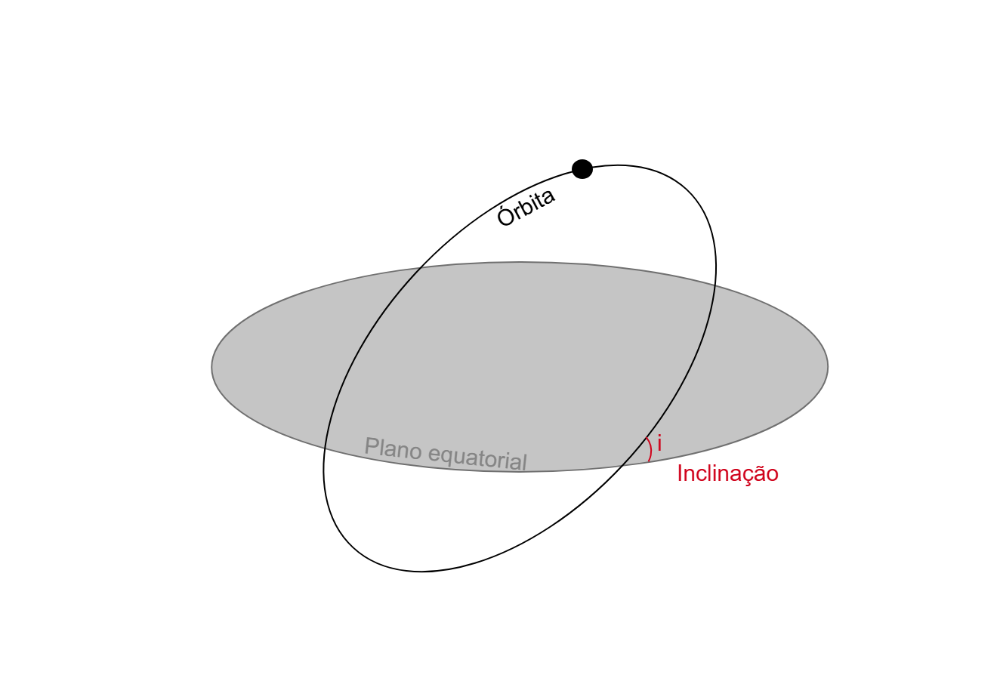
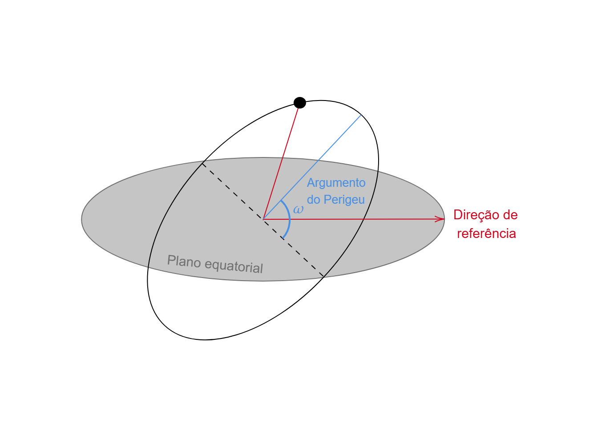

# 1. Introdução
A exploração do ambiente espacial, mais especificamente as órbitas terrestres, tem sido de suma importância e um dos maiores triúnfos da engenharia e física da atualidade. Desde os primeiros lançamentos de satélites, a previsão das trajetórias de objetos em órbita com alta precisão se tornou indispensável para a comunicação, GPS, pesquisas científicas e outros [@bate1971]. Nesse contexto, a Estação Espacial Internacional (International Space Station, ISS), literalmete um laboratório em constante queda livre, se torna objeto ideal de estudo para a demonstração das leis da mecânica clássica e o poder de previsão.

Desta maneira, este Portfólio WEB apresenta uma proposta didática para o ensino das técnicas de simulção orbital utilizando a linguagem de programação Python, tomando como estudo de caso a trajetória da ISS em torno da Terra. O portfólio abordará os temas físicos como as descobertas de Tycho Brahe e Johann Kepler, a dedução da equação de Newton para o problema de 2 corpos, porém também passará por tópicos computacionais, como programação em python,métodos computacionais e métodos de integração numérica. O objetivo central é demonstrar como modelos matemáticos podem ser traduzidos em algoritmos, com capacidade de prever o comportamento de satélites em órbitas de baixa altitude (Low Earth Orbits, LEOs), com o intuito de passar todos os passos necessários para atingir o mesmo resultado do portfólio, e quando não for possível passar sugestões de referencias complementares. Através de uma abordagem prática, exploramos como as forças gravitacionais e outras variáveis moldam o movimentos dos objetos e como métodos de integração numérica, como Método de Euler e Runge Kutta, permitem estimar com alta precisão a posição e a velocidade da estação ao longo do tempo [@vallado2013; @curtis2013].

A intenção desse trabalho é ser mais que apenas um repositório de códigos, é dar contextualização sobre a física por de trás dos algoritimos. Ao longo das seções serão discutidos temas como : Elementos Orbitais; Equações Diferenciais Ordinárias (EDOs); utilização de scripts em Python e bibliotecas como Numpy e Matplot.lib, para visualização 3D das órbitas; achatamento terrestre e coeficiente $J2$; Arrasto Atmosférico e etc.

Dessa forma esse portfólio serve como uma ponte entre a física teórica e a experimentação computacional, ofertando um recurso interativo aos entusiastas que queiram aprofundar seus conhecimentos sobre dinâmica orbital.

# 2. Contexto Histórico das Leis de Kepler

Johann Kepler foi um matemático e astrônomo alemão que viveu durante os séculos XVI e XVII. Época que ficou conhecida como Revolução Científica, pois foi palco de diversas descobertas e fortalecimento da ciência de modogeral, sendo uma delas as descobertas de Kepler. Apesar de ter feito diversos estudos, ficou amplamente conhecido por estudar mecânica celeste, e ter criado três leis do movimento, que posteriormente foram nomeadas de as três Leis de Kepler. 

Entretanto, diferente do que se pode imaginar, o jovem matemático não pensou exatamente nas leis quando começou os estudos. Kepler tinha a ambição de provar seu modelo do sistema solar verídico. Entretanto, Tycho Brahe, outro astrônomo, o contratou para provar seu próprio modelo e, através de suas observações, formular matematicamente as órbitas, já que o mesmo não era tão íntimo da matemática e focava seus esforços em fazer observações e registrá-las. Tanto o modelo de Kepler, quanto o modelo de Tycho, eram diferentes dos modelos mais aceitos na época [@cohen1967].

Durante esse período, existiram dois modelos cosmológicos que dividiram as opiniões, o modelo geocêntrico de Ptolomeu e o modelo Heliocêntrico de Copérnico. No modelo de Ptolomeu, como o próprio nome sugere, a Terra, nosso planeta, estaria no centro do Universo, com os outros corpos celestes a orbitando, com órbitas perfeitamente circulares. Já, no modelo de Copérnico, o heliocêntrico, teríamos o Sol como objeto central e os planetas também o circundando com órbitas perfeitamente circulares [@damasio2011].

{width="85%" #fig-ModeloPtolomeu}

{width="85%" #fig-ModeloCopernico}

O modelo de Tycho era inspirado no modelo de Ptolomeu, a Terra estava no centro e o Sol a orbitava, porém, diferente do modelo anterior, os planetas orbitavam o Sol. Esse modelo, assim como os outros dois também previa órbitas circulares .Por fim, o modelo de Kepler, auto declarado copernicano, se baseava no modelo heliocêntrico. O mesmo consistia quase que inteiramente igual ao de Copérnico, exceto que ele propunha uma proporção entre as distâncias, baseadas nos sólidos regulares, onde cada órbita era circunscrita em um dos sólidos [@cohen1967], como é possível ver no esquema [tal].

{width="50%" #fig-ModeloTycho}

Porém, como todos os cidadãos brasileiros que passaram pela educação básica brasileira sabem — ou pelo menos deveriam saber — todos os modelos cometem o mesmo erro: as órbitas circulares. Foi daí que surgiu a grande sacada de Kepler, munido do grandioso arsenal de observações de Tycho Brahe, que por sua vez era excepcional em fazer e registrar as mesmas, abandonou as órbitas circulares e percebeu que as órbitas na verdade descreviam elipses, uma curva oval. Esse ato de Kepler, além de genial, foi de extrema coragem, tendo em vista que as órbitas circulares prevaleciam desde a época de Platão e Aristóteles (século V a. C.).

{width="70%" #fig-ModeloKepler}

Com essa mudança de perspectiva, Kepler originou suas três Leis que, por sua vez, descreviam os movimentos elípticos das órbitas planetárias. Sendo a primeira lei, a Lei das órbitas, a segunda, a Lei das Áreas e por último, mas não menos importante, a terceira lei, a Lei dos Períodos.

# 3. Leis de Kepler (educação básica)

Todas as 3 Leis utilizaram [@halliday&resnick2012] como referência.

- Lei das órbitas: Os planetas orbitam o Sol em elipses. Por isso temos a equação da elipse simplificada, que descreve o movimento elíptico com centro ($0,0$): 

$$ \frac{x^2}{a^2} + \frac{y^2}{b^2} = 1 $$ {#eq-elipse}

{width="70%" #fig-elipselei1}

- Lei das áreas:  A linha reta conectando o planeta ao Sol varre áreas iguais em tempos iguais.

$$ \frac{A_{1}}{\Delta t_{1}} = \frac{A_{2}}{\Delta t_{2}} $$ {#eq-2lei}

{width="70%" #fig-elipselei2}

- Lei dos períodos: O quadrado do período orbital ($T^2$), é proporcional ao cubo da distância média ao Sol ($R^3$).

$$ \frac{T_1^2}{R_1^3} = \frac{T_2^2}{R_2^3}$$ {#eq-3lei}

{width="70%" #fig-elipselei3}

# 4. Primeiro código em Python

Faremos esse primeiro código de forma mais simples, para que seja o primeiro contato com as simulações em python. Porém, apesar de mais simples precisaremos entrar em contato com alguns novos conhecimentos para a escrita desse código.

## 4.1. Conhecimentos adicionais da elipse

- $a$ = semieixo maior : Define a distância do centro da elipse até a maior extremidade.
- $b$ = semieixo menor : Define a distância do centro da elipse até a menor extremidade, e pode ser calculado através de: 

$$ a \sqrt{1 - e^2} $$ {#eq-semieixomenor}

- $e$ = excentricidade da órbita: Define o quão achatada será a elipse.

- foco = o foco da elipse. A elipse possui dois focos ($F_1$ e $F_2$), que são pontos fixos no eixo maior, cuja a soma das distância de qualquer ponto ($P$) da elipse é constante e igual a $2a$. O foco pode ser encontrado por: 

$$ foco = a e $$ {#eq-foco}

## 4.2. Conceitos adicionais de programação para o primeiro código

Para este primeiro código é interessante possuir uma noção básica de programação, porém não é necessário e qualquer um pode embarcar nesse desafio. É recomendado a utilização do google Collab para escrita dos códigos, ele é uma ferramenta dinâmica, de facil utilização, não requisita hardware pesado e pode ser acessado de forma gratuita no seguinte endereço: <a href="https://developers.google.com/colab">Google Colab</a>.

No código iremos utilizar duas bibliotecas do Python: a Numpy, que é uma biblioteca fundamental para computação científica em Python, essencial para manipulação de grandes arrays e matrizes multidimensionais, ou seja, nos ajudará com manipulações matemáticas; a outra biblioteca que iremos usar é a Matplotlib, que nos dará as ferramentas necessárias para fazer os gráficos. A documentação das duas bibliotecas pode ser encontrada nos respectivos links: <a href="https://numpy.org/pt/">Biblioteca Numpy</a> ; <a href="https://matplotlib.org/">Biblioteca Matplotlib</a>.

Em questão de linguagem de programação utilizada para os códigos, será em sua totalidade apenas Python, logo não é necessário conhecimentos prévios de outras linguagens. A documentação da linguagem pode ser acessada através de: <a href="https://www.python.org/">Python</a>.

## 4.3. Primeira simulação

Agora, seguindo o passo a passo comentado do código a seguir, é possível fazermos nossa primeira simulação em python, baseada na equação da elipse e fundamentada nas leis de Kepler.

```{python}
import numpy as np
import matplotlib.pyplot as plt

# 1. Configurações da Elipse (1ª Lei)
a = 5       # Comprimento da órbita
e = 0.6     # Excentricidade, ou seja, o quanto a órbita é "achatada" (0 a 1)
b = a * np.sqrt(1 - e**2)  # Largura da órbita
foco = a * e               # Distância do Sol até o centro

# 2. Criar os pontos da linha da órbita
t = np.linspace(0, 2 * np.pi, 100)
x = a * np.cos(t) - foco   # Movemos a elipse para o Sol ficar no (0,0)
y = b * np.sin(t)

# 3. Desenhar o gráfico
plt.figure(figsize=(8, 5))

# Desenha a órbita e o Sol
plt.plot(x, y, 'gray', label='Caminho do Planeta')
plt.scatter(0, 0, color='orange', s=300, label='Sol') # Sol no foco

# 4. Demonstrar a 2ª Lei (Velocidade)
# Planeta no Periélio (Perto do Sol -> Rápido)
plt.scatter(a-foco, 0, color='red', s=100)
plt.text(a-foco, 0.5, "Rápido", color='red', fontweight='bold')

# Planeta no Afélio (Longe do Sol -> Lento)
plt.scatter(-a-foco, 0, color='blue', s=100)
plt.text(-a-foco, 0.5, "Lento", color='blue', fontweight='bold')

# Estética
plt.title("Simulação Simplificada das Leis de Kepler")
plt.axhline(0, color='black', lw=0.5, ls='--')
plt.axvline(0, color='black', lw=0.5, ls='--')
plt.legend()
plt.axis('equal')
plt.show()

```


# 5. Kepler para Newton

Para o estudo de órbitas, além de Kepler, é necessário, principalmente, o entendimento da Lei da Gravitação Universal de Newton. É pertinente entender como surge essa lei, dedução que é possível através das Leis de Kepler. A abordagem utilizada neste portfólio é por meio da aceleração centrípeta.

Baseado no fato de que, para um corpo se manter em um movimento circular, é necessária a ação de uma aceleração centrípeta, descrita pela equação (6)

$$
a_{c} = \frac{v^2}{R}
$$ {#eq-aceleração-centrípeta}

Tendo em vista que $a_{c}$ é a aceleração centrípeta, $R$ é o raio orbital e $v$ é a velocidade orbital. Podemos também substituir a velocidade por 
$$
v = \frac{2 \pi R}{T}
$$

Substituindo $v$,

$$
a_{c} = \frac{(\frac{2 \pi R}{T})^2}{R} = \frac{4 \pi^2 R^2}{T^2} \frac{1}{R} = \frac{4 \pi^2 R}{T^2}
$$ {#eq-aceleração-centripeta2}

Anteriormente, foi definida a Terceira Lei de Kepler como

$$
\frac{T_{1}^2}{R_{1}^3} = \frac{T_{2}^2}{R_{2}^3}
$$

Sendo estabelecida a igualdade dessa razão, é possível expressá-la, também, na forma

$$
\frac{T^2}{R^3} = k
$$

onde $k$ é a constante de Kepler.

Portanto, isolando $T^2$, obtemos a seguinte relação

$$
T^2 = k R^3
$$

Substituindo esse novo resultado na equação (7)

$$
a_{c} = \frac{4 \pi^2 R}{k R^3} = \frac{4 \pi^2}{k} \frac{1}{R^2}
$$

Agora, utilizando a Segunda Lei de Newton, $F = m a$, onde $F$ é a força (em Newtons), $m$ é a massa (em Kg) e $a$ é a aceleração (em m/s), temos que a força centrípeta ($F_{c}$) é dada por

$$
F_{c} = m \left(\frac{4 \pi^2}{k R^2}\right)
$$

Por fim, com a utilização da Terceira Lei de Newton, que estabelece que toda força exercida em um corpo resulta em uma outra força com mesmo módulo e intensidade, porém de direções opostas, temos os dois corpos ($m$ e $M$) exercendo a mesma Força em direções opostas, resultando na atração gravitacional. Por isso, Newton concluiu que a constante $k$ da equação deveria estar relacionada à massa do corpo central $M$, juntamente de uma constante, a qual ele definiu como a constante gravitacional, $G$:

$$
k = \frac{4 \pi^2}{G M}
$$

Dessa forma, é concluída a equação clássica

$$
F_{g} = G \frac{M m}{R^2} 
$$ {#eq-leigravitação}

# 6. Órbitas Keplerianas 

A partir deste tópico, cursar ou estar cursando uma graduação de exatas, pode ser de extrema ajuda para entender com mais facilidade os conteúdos, porém, novamente, não é de fato um requisito, sintam-se a vontade para se desafiar.


O ponto de partida para entender a dinâmica orbital é o problema de dois corpos. Esse sistema consiste em um corpo esférico central (Terra) de massa = $M$ e um satélite (ISS) de massa = $m$, onde temos a condição $M >> m$. Com a atração gravitacional ($F_g$) sendo a única força atuante no sistema e $G$ como constante gravitacional, dada pela seguinte equação, retirada de @curtis2013:

$$
\vec{F_g} = - G \frac{M \cdot m}{r^2} \hat{r} 
$$ {#eq-Força-G}

Entenda $r$ como a distancia do ponto central de cada massa e $\hat{r}$ como o sentido do vetor, que no caso é radial.

Esquema do problema de dois corpos (P2C):

{width=50% #fig-esquemap2c}

onde, $r$ $\cdot$ $\hat{r}$ = $\vec{r}$ é o vetor posição do satélite com origem no centro da Terra. Assim, temos a seguinte equação quando aplicamos a força na 2ª Lei de Newton: 

$$  
\vec{\ddot r} + \frac{\mu}{r^3} \vec{r} = 0 
$$ {#eq-2ª-Lei}


e temos $\mu$ = $G(M + m) \approx GM$ como parâmetro gravitacional, com essa aproximação sendo possível pela diferença muito grande de massa entre os dois corpos.

A solução desta equação diferencial vetorial é o movimento do satélite em um plano fixo (plano orbital), e sua trajetória se dá por uma das seções cônicas (círculo, elipse, parábola ou hipérbole), tendo como um dos focos a massa central M [@bate1971; @murray2000]. Como este portfólio utiliza em específico um satélite com órbita fechada, a solução do mesmo é uma elipse com o centro de massa presente em um dos focos. A equação da órbita elíptica nas coordenadas $r$ e $\nu$ se da por: 

$$ r = \frac{p}{1 + e \space cos \nu} $$

Sendo, $p$ = $a(1-e^2)$ o semi-latus rectum, $a$ o comprimento do semi eixo maior e $e$ a excentricidade.

## 6.1 Elementos Orbitais Clássicos

Uma maneira muito boa — e que será usada neste portfólio — de descrever as órbitas keplerianas, são os elementos orbitais, que nada mais são do que um conjunto de seis parâmetros matemáticos, utilizados para definir de forma única o formato, orientação e posição de um corpo celeste ao redor de outro, ou seja, definir a órbita [@bate1971].

Os seis parâmetros são: 

- Semieixo maior ($a$)

- Excentricidade ($e$)

- Inclinação ($i$)

- Ascensão Reta do Nodo Ascendente ($Ω$)

- Argumento do Perigeu ($ω$)

- Anomalia Verdadeira ($ν$), Anomalia Excêntrica ($E$) ou Anomalia Média ($M_0$ para um tempo $T_0$)


A partir dos próximos subtópicos cada um dos elementos orbitais será explicado e exemplificado por imagens.

### Semieixo maior $a$

O semieixo maior $a$ é a definição do tamanho da órbita, mostrado na (@fig-semieixomaior). Ele é a metade da distância do perigeu (ponto mais próximo) e o apogeu (ponto mais distante).

$$
a = - \frac{\mu}{2 \epsilon}
$$

{width=100% #fig-semieixomaior}

### Excentricidade $e$

Como já comentado tópicos atrás, a excentricidade $e$ define o formato da órbita, no caso específico das órbitas fechadas, quanto mais próximo de 0 o valor de $e$, a órbita tende a um círculo, e quanto mais próximo de 1, a órbita tende a uma elipse com focos infinitos, ou seja, próximo de uma linha reta. Como mostrado na (@fig-excentricidade)

$$
e = |\frac{1}{\mu}[\left(v^2 - \frac{\mu}{r}\right)r - (\vec{r} \cdot \vec{v})v]|
$$

{#fig-excentricidade}

### Inclinação $i$

Tendo um plano fixo de referência, que, geralmente, é o plano do equador terrestre, no caso da Terra, é o ângulo entre esse plano referencial e o plano orbital. Assim medindo a inclinação da órbita, como na @fig-inclinação.

$$
i = \arccos{ \left(\frac{h_{z}}{h}\right)}
$$

{width=100% #fig-inclinação}

### Ascensão Reta do Nodo Ascendente $Ω$

Também conhecido como Big omega, ele é o ângulo do equinócio vernal no plano equatorial até o ponto onde a Terra cruza o equador em direção ao Norte (nodo ascendente), como mostra a (@fig-bigomega). Ou seja, dado um plano referencial fixo, o plano orbital gira na orientação do plano referencial, o que é medido por esse parâmetro.

$$
\cos{(\Omega)} = \frac{n_{x}}{|n|}
$$

{width=100% #fig-bigomega}

### Argumento do Perigeu $ω$

O argumento do perigeu, ou omega, é o ângulo no plano orbital, do nodo ascendente até o ponto de maior aproximação do corpo central, o perigeu. Pode ser observado na (@fig-omega). Ou seja, é o ângulo que mede o movimento da órbita ao girar em torno do plano orbital.

$$
\cos{(\omega)} = \frac{n \cdot e}{|n||e|}
$$

{width=100% #fig-omega}

### Anomalia Verdadeira $ν$

É o ângulo que mede a posição real do satélite, medido do foco da elipse (corpo central), entre o ponto do perigeu até a posição do corpo que orbita. Como mostrado na (@fig-anomaliaverdadeira). Ou seja, dado ponto de início $0 \degree$, a anomalia verdadeira é o ângulo que mede a posição em relação ao início, que é dado pelo $\omega$.

$$
\cos{(\nu)} = \frac{\vec{e} \cdot \vec{r}}{|e||r|}
$$

{width=100% #fig-anomaliaverdadeira}


### Anomalia Excêntrica ($E$)
A Anomalia Excêntrica ($E$) é um parâmetro angular auxiliar utilizado para facilitar a transição entre a geometria de uma elipse e o movimento temporal de um satélite.

$$
\tan{\left( \frac{E}{2} \right)} = \sqrt{\frac{1-e}{1+e}} \tan{\left(\frac{\nu}{2}\right)}
$$

### Anomalia Média $M$

A Anomalia Média é uma representação da Anomalia Verdadeira, assumindo uma velocidade angular constante.

$$
M = E - e \space \text{sen}(E)
$$

# ?. Glossário
- Elipse:
- Cônicas: 
- Período orbital:
- Array:
- Matriz:
- Aceleração centrípeta:
- Raio orbital:
- Velocidade orbital:
- Periastro:
- Apoastro:
- Nodo ascendente:


# Bibliografia


